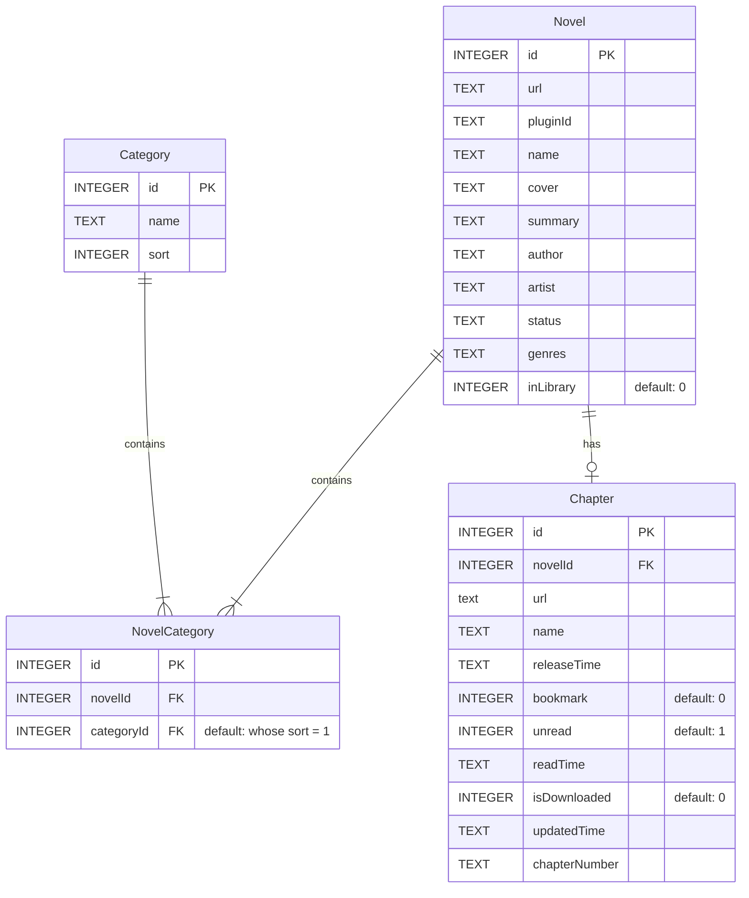

# Contributing Guide

Thank you for your interest in contributing to LNReader! This guide will help you get started with development.

## Table of Contents
- [Prerequisites](#prerequisites)
- [Development Setup](#development-setup)
- [Development Workflow](#development-workflow)
- [Code Style & Standards](#code-style--standards)
- [Database Schema](#database-schema)
- [Making Contributions](#making-contributions)
- [Troubleshooting](#troubleshooting)

## Prerequisites

Before you begin, ensure you have the following installed:

- Node.js (≤ 16.13.1)
  - [nvm](https://github.com/nvm-sh/nvm) is recommended for version management
- Java SDK (≤ 11)
  - [jenv](https://www.jenv.be/) is recommended for version management
- [Android SDK](https://developer.android.com/studio)
- [Android Debug Bridge (adb)](https://developer.android.com/studio/command-line/adb)
- Git
- A code editor (VS Code recommended)

## Development Setup

1. Fork the repository to your GitHub account

2. Clone your fork:
```bash
git clone https://github.com/<your-username>/lnreader.git
cd lnreader
```

3. Set up the development environment:
```bash
# Install dependencies
npm install

# Start Metro bundler
npm start

# In a new terminal, deploy to Android
npm run android
```

4. For building release APK:
```bash
npm run buildRelease
# The APK will be available at: ~/lnreader/android/app/build/outputs/apk/release/
```

## Development Workflow

1. Create a new branch for your feature/fix:
```bash
git checkout -b feature/your-feature-name
```

2. Development Tips:
   - To view changes, save your code and press "r" in the Metro terminal
   - Use `adb devices` to verify connected Android devices/emulators

## Code Style & Standards

We use ESLint for code consistency. To check your code:

```bash
npm run lint
```

Key Style Guidelines:
- Use TypeScript for new files
- Follow existing file structure
- Add comments for complex logic
- Include JSDoc for public functions
- Use meaningful variable/function names

## Database Schema

The application uses SQLite with the following schema:



## Making Contributions

1. Commit your changes:
```bash
git add .
git commit -m "Description of changes"
```

2. Keep your fork updated:
```bash
git remote add upstream https://github.com/LNReader/lnreader.git
git fetch upstream
git rebase upstream/main
```

3. Push your changes:
```bash
git push origin feature/your-feature-name
```

4. Create a Pull Request:
   - Use a clear PR title and description
   - Reference any related issues
   - Include screenshots for UI changes
   - List any new dependencies

## Troubleshooting

Common Issues:
1. Build Errors
   - Ensure all prerequisites are correctly installed
   - Try cleaning the project: `cd android && ./gradlew clean`
   - Check Android SDK versions match

2. Metro Bundler Issues
   - Clear Metro cache: `npm start -- --reset-cache`
   - Ensure no other Metro instances are running

For additional help:
- Check existing issues on GitHub
- Join our community chat
- Create a new issue with detailed information about your problem
